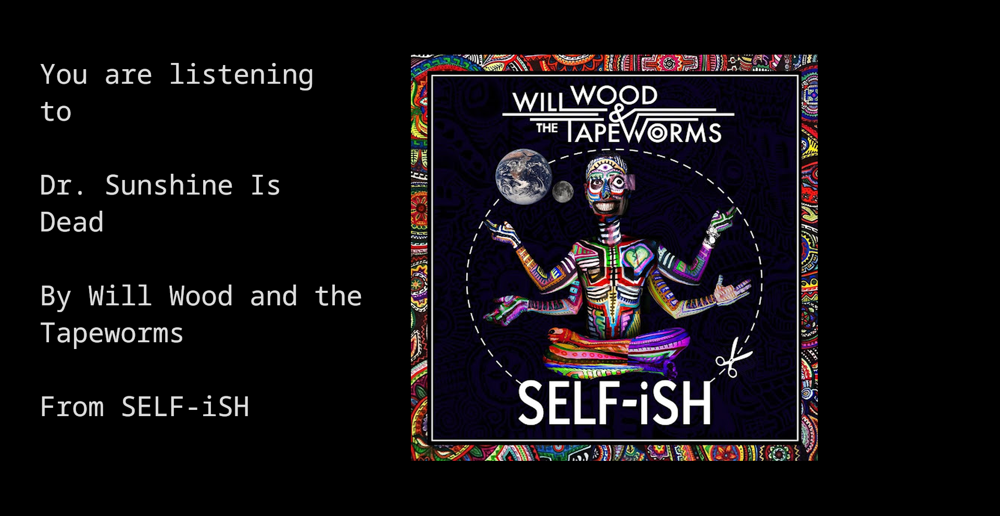

# Tallyall Player
inspired by the video format from [@tallyall on youtube](https://www.youtube.com/@tallyall) of the miracle musical demos/alternative versions

## How to use
required dependencies: playerctl, a terminal that supports displaying images using kitten icat
download and run tallyallplayer

## How to compile
gcc main.c -o tallyallplayer
(tested on i use arch btw, should work on any sane linux distro)
